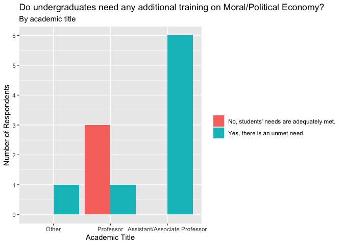

Exploratory Data Analysis on CASBS Short and Long form surveys
================
Isaac Arocha
2020-04-05

  - [Interesting Tidbits from the
    surveys](#interesting-tidbits-from-the-surveys)
      - [Short](#short)
      - [Long](#long)
  - [Making the Short Data
    Digestible](#making-the-short-data-digestible)
  - [Making the Long Data Digestible](#making-the-long-data-digestible)

``` r
# Libraries
library(tidyverse)
library(here)
library(openxlsx)
# Parameters

short_path <- 
  here("data/CASBS_short.csv")

long_path <- 
  here("data/CASBS_long.csv")

short <- 
  read_csv(short_path) %>% 
  filter(!str_detect(StartDate, "Import"))

long <- 
  read_csv(long_path) %>% 
  select(!contains("i_"))
  
#===============================================================================
```

## Interesting Tidbits from the surveys

### Short

``` r
finished_short <- 
  short %>% 
  mutate(Finished = as.logical(Finished)) %>% 
  pull(Finished)

finished_short %>% 
  mean(na.rm = TRUE)
```

    ## [1] 0.6818182

``` r
finished_short %>% 
  sum(na.rm = TRUE)
```

    ## [1] 75

Just shy of 70% of the survey’s recipients completed the survey in full.

``` r
short %>% 
  select("duration" = `Duration (in seconds)`, "finished" = Finished) %>% 
  mutate(
    duration = as.integer(duration), 
    finished = as.logical(finished)
  ) %>% 
  filter(finished) %>% 
  pull(duration) %>% 
  median(na.rm = TRUE) / 60
```

    ## [1] 5.683333

Of those that completed the short survey in full, the median response
time was about 5 minutes and 41 seconds.

### Long

``` r
finished_long <- 
  long %>% 
  mutate(Finished = as.logical(Finished)) %>% 
  pull(Finished)

finished_long %>% 
  mean(na.rm = TRUE)
```

    ## [1] 0.55

``` r
finished_long %>% 
  sum(na.rm = TRUE)
```

    ## [1] 11

About 55% of respondents completed the long survey in full.

``` r
long %>% 
  select("duration" = `Duration (in seconds)`, "finished" = Finished) %>% 
  mutate(
    duration = as.integer(duration), 
    finished = as.logical(finished)
  ) %>% 
  filter(finished) %>% 
  pull(duration) %>% 
  median(na.rm = TRUE) / 60
```

    ## [1] 16.03333

Of those that completed the long survey in full, the median response
time was about 16 minutes.

``` r
long %>% 
  select(`3`) %>% 
  drop_na() %>% 
  mutate(
    `3` = 
      case_when(
        `3` == "Yes, there is an unmet need." ~ TRUE,
        `3` == "No, students' needs are adequately met." ~ FALSE,
        TRUE ~ NA
    )
  ) %>% 
  pull() %>% 
  mean(na.rm = TRUE)
```

    ## [1] 0.6666667

Two-Thirds of respondents said that yes, there exists an unmet need
among undergraduate students for additional training in Moral/Political
Economy.

``` r
long %>% 
  select(Title, `3`) %>% 
  filter(row_number() > 2) %>% 
  drop_na() %>% 
  count(Title, `3`) %>% 
  add_row(
    Title = "Assistant/Associate Professor",
    `3` = "No, students' needs are adequately met.",
    n = 0
  ) %>% 
  add_row(
    Title = "Other (please specify)",
    `3` = "No, students' needs are adequately met.",
    n = 0
  ) %>% 
  ggplot(mapping = aes(x = fct_reorder(Title, n), y = n, fill = `3`)) +
  geom_col(position = "dodge") +
  scale_y_continuous(breaks = scales::breaks_width(1)) +
  scale_x_discrete(
    labels = c("Other", "Professor", "Assistant/Associate Professor")
  ) +
  labs(
    title = 
      "Do undergraduates need any additional training on Moral/Political Economy?",
    subtitle = "By academic title",
    x = "Academic Title",
    y = "Number of Respondents",
    fill = NULL
  )
```

<!-- --> This
is interesting\! There appears to be a relationship between the title of
an academic and how likely that academic is to believe that there exists
an unmet need among undergraduate students for additional training in
Moral/Political Economy. Obviously, the sample size is far too small to
be indicative of much, but it is interesting nonetheless.

## Making the Short Data Digestible

First, I’ll create a table that makes it easy to see what courses
reflect on issues of moral and political economy.

``` r
courses_s <- 
  short %>% 
  select(Name, Institution, Q6_4:Q6_8) %>% 
  pivot_longer(
    cols = Q6_4:Q6_8,
    names_to = "null",
    values_to = "Courses"
  ) %>% 
  select(-null) %>% 
  filter(Name != "Name") %>% 
  drop_na()
```

Now, onto the useful digital resources.

``` r
digital_resources_s <- 
  short %>% 
  select(Name, Institution, Q10_4:Q10_8) %>% 
  pivot_longer(
    cols = Q10_4:Q10_8,
    names_to = "null",
    values_to = "Resources"
  ) %>% 
  select(-null) %>% 
  filter(
    !str_detect(Resources, "Resource"),
    !str_detect(Name, "Jonathan Levy")
  ) %>% 
  drop_na() %>% 
  distinct()
```

And, lastly, I’ll move onto the faculty recommendations.

``` r
faculty_recs_s <- 
  short %>% 
  select(Name, starts_with("Q20")) %>% 
  drop_na() %>% 
  unite(col = "rec 1", Q20_1_1, Q20_1_9, sep = " - ") %>% 
  unite(col = "rec 2", Q20_2_1, Q20_2_9, sep = " - ") %>% 
  unite(col = "rec 3", Q20_3_1, Q20_3_9, sep = " - ") %>%
  unite(col = "rec 4", Q20_4_1, Q20_4_9, sep = " - ") %>%
  unite(col = "rec 5", Q20_5_1, Q20_5_9, sep = " - ") %>% 
  filter(row_number() > 2) %>% 
  pivot_longer(cols = starts_with("rec"), names_to = "null", values_to = "Recommendation") %>% 
  select(-`Q20_5_1 - Topics`, -null)
```

## Making the Long Data Digestible

First, I’ll work on making question 1 easy to read.

``` r
undergrad_programs_l <- 
  long %>% 
  select(
    Name, 
    Institution,
    `1`:`1f`
  ) %>% 
  mutate(
    `1` = case_when(`1` == "Yes" ~ TRUE, `1` == "No" ~ FALSE, TRUE ~ NA)
  ) %>% 
  filter(`1`) %>% 
  select_if(is.character) %>% 
  rename(
    "Program Title" = "1a",
    "Broad Student Interest?" = "1b",
    "Coherent Curriculum?" = "1c",
    "Foster skills difficult to achieve with 1 discipline?" = "1d",
    "Civic engagement?" = "1e",
    "How does it foster civic engagement?" = "1ei",
    "Suggestions on engagement?" = "1eii",
    "Program's curricular requirements?" = "1f"
  )
```

Onto question 2.

``` r
more_undergrad_models_l <- 
  long %>% 
  select(
    Name, 
    Institution,
    `2`,
    `2a`
  ) %>% 
  mutate(
    `2` = case_when(`2` == "Yes" ~ TRUE, `2` == "No" ~ FALSE, TRUE ~ NA)
  ) %>% 
  drop_na() %>% 
  select(Name, Institution, "Effective models outside of home university" = `2a`)
```

Now, question 3.

``` r
unmet_need_undergrad_l <- 
  long %>% 
  select(Name, Title, `3`, `3a`) %>% 
  rename("Unmet Need" = "3", "How to address?" = "3a") %>% 
  filter(row_number() >= 3) %>% 
  drop_na(`Unmet Need`)
```

Next, questions 4 and 5.

``` r
foundational_text_l <- 
  long %>% 
  select(Name, Institution, `4`, `5`) %>% 
  rename("Foundational Texts?" = "4", "Ensure Inclusivity?" = "5") %>% 
  filter(row_number() >= 3) %>% 
  drop_na(`Foundational Texts?`)
```

Question 6.

``` r
grad_programs_l <- 
  long %>% 
  select(Name, Institution, `6`:`6e`) %>% 
  mutate(
    `6` = case_when(`6` == "Yes" ~ TRUE, `6` == "No" ~ FALSE, TRUE ~ NA)
  ) %>% 
  filter(`6`, !is.na(`6`)) %>% 
  select(-`6`) %>% 
  rename(
    "Grad programs to help students in cross-disciplinary study of moral/political economy?" = "6a", 
    "Broad student interest" = "6b",
    "Is program helpful or problematic for students' careers?" = "6c",
    "Does program engender novel approaches to pol. econ problems in students' home disciplines?" = "6d",
    "Links/Files?" = "6e"
  )
```

Question 7.

``` r
more_grad_models_l <- 
  long %>% 
  select(
    Name, 
    Institution,
    `7`,
    `7a`
  ) %>% 
  mutate(
    `7` = case_when(`7` == "Yes" ~ TRUE, `7` == "No" ~ FALSE, TRUE ~ NA)
  ) %>% 
  filter(`7`, !is.na(`7`)) %>% 
  select(Name, Institution, "Effective models outside of home university" = `7a`)
```

Question 8

``` r
unmet_need_grad_l <- 
  long %>% 
  select(Name, Title, `8`, `8a`) %>% 
  rename("Unmet Need" = "8", "How to address?" = "8a") %>% 
  filter(row_number() >= 3) %>% 
  drop_na(`Unmet Need`)
```

Interdisciplinary training and education at the Graduate Level

``` r
interdisciplinary_training_grad_l <- 
  long %>% 
  select(Name, Institution, `9`:`9bi`) %>% 
  rename(
    "Do hiring practicers reward interdisciplinary training for grad students?" = "9",
    "What interdisciplinary training is valued? How is it rewarded?" = "9a",
    "Should incentive structures change to support interdisciplinary training?" = "9b",
    "Why should incentive structures change to support interdisciplinary training?" = "9bi"
  ) %>% 
  drop_na(`Do hiring practicers reward interdisciplinary training for grad students?`) %>% 
  filter(row_number() > 2)
```

``` r
future_development_online_l <- 
  long %>% 
  select(Name, Institution, `10`, `10a`) %>% 
  filter(row_number() > 2, !is.na(`10`)) %>% 
  rename(
    "Opportunity for future development of online classes/modules about moral/political econ at your institution?" = "10",
    "Explain those opportunites" = "10a"
  )
```

``` r
service_civic_engagement_l <- 
  long %>% 
  select(Name, Institution, `11`, `11a`) %>% 
  filter(row_number() > 2, !is.na(`11`)) %>% 
  rename(
    "University involved in service/civic engagement to connect ethical & economic learning" = "11",
    "Elaborate" = "11a"
  )
```

``` r
new_initiative_l <- 
  long %>% 
  select(Name, Institution, `12`, `12a`, `12b`) %>% 
  filter(row_number() > 2, !is.na(`12`)) %>% 
  rename(
    "Would you start a new initiative to foster cross-disciplinary study of moral/political economy of undergrads?" = "12",
    "Elaborate on the form of such an initiative" = "12a",
    "Why would you not?" = "12b"
  )
```

``` r
quote_l <- 
  long %>% 
  select(Name, Institution, `13`, `13_3_TEXT`) %>%
  filter(row_number() > 2) %>% 
  transmute(
    Name,
    Institution,
    `Would you be willing to be identified and quoted in a report about existing models and future opportunities?` = 
      if_else(`13` %in% c("Yes", "No", NA_character_), `13`, `13_3_TEXT`)
  )
```

\#Writing the now-digestible data to excel

``` r
data_s <- 
  list(
    "Courses" = courses_s,
    "Digital Resources" = digital_resources_s, 
    "Faculty Recommendations" = faculty_recs_s
  )

write.xlsx(data_s, here("eda_short_output.xlsx"))

data_l <- 
  list(
    "Cross Disciplinary Undergraduate Programs" = undergrad_programs_l, 
    "Non-Native Institutions'Cross Disciplinary Undergraduate Programs" = more_undergrad_models_l,
    "Unmet Need Undergrads" = unmet_need_undergrad_l,
    "Foundational Texts" = foundational_text_l,
    "Cross Disciplinary Graduate Programs" = grad_programs_l,
    "Non-Native Institutions'Cross Disciplinary Graduate Programs" = more_grad_models_l,
    "Unmet Need Grads" = unmet_need_grad_l,
    "Interdisciplinary Training for Graduates" = interdisciplinary_training_grad_l,
    "Opportunities for Future Programs Online" = future_development_online_l,
    "Institutional Engagement in Service" = service_civic_engagement_l,
    "New Initiatives" = new_initiative_l,
    "Quote" = quote_l
  )

write.xlsx(data_l, here("eda_long_output.xlsx"))
```

    ## Warning in write.xlsx(data_l, here("eda_long_output.xlsx")): Truncating list
    ## names to 31 characters.
